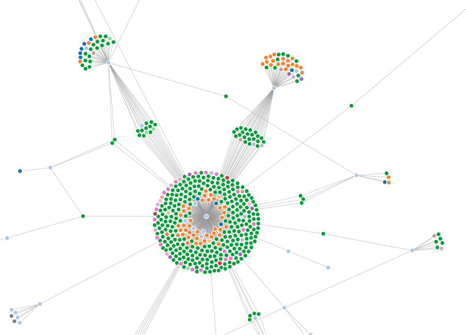

# dependencies-cli

This project implements an SFDX plugin for the [Salesforce Dependencies API](https://releasenotes.docs.salesforce.com/en-us/summer18/release-notes/rn_metadata_metadatacomponentdependency.htm). With the plugin you are able to analyze dependencies between Salesforce [second-generation packages](https://developer.salesforce.com/docs/atlas.en-us.sfdx_dev.meta/sfdx_dev/sfdx_dev_dev2gp_intro.htm) as well as dependencies between Salesforce objects deployed in your org. The plugin is meant for Salesforce developers and administrators trying to

1. Analyze package and object level dependencies
2. Untangle large monolithic orgs to split into smaller (more managable) orgs
3. Indentify and extract base packages with shared objects
4. Identify package level version dependencies

The plugin does not automate any of these steps but uses graph technology to help navigate the complexities of a Salesforce org. The main output thus far is a set of D3.js force directed graphs used to visualize dependencies and recommendation actions.

> Note: A few commands use the [Salesforce Dependencies API](https://releasenotes.docs.salesforce.com/en-us/summer18/release-notes/rn_metadata_metadatacomponentdependency.htm) which is currently in open beta for production orgs but fully enabled for sandbox orgs. Please make sure your org has the API enabled or work with Salesforce support to enable it.

** The plugin is NOT a Salesforce supported project and release as a community project under open source licenses. Anyone is invited to help improve and extend the code. **

## Install

0) [Install the Salesforce CLI](https://developer.salesforce.com/docs/atlas.en-us.sfdx_setup.meta/sfdx_setup/sfdx_setup_install_cli.htm) (SFDX)

```
npm install sfdx-cli --global
```

1) Make sure you have the latest version

```
sfdx update
```

2) Install the plugin via npm

```
sfdx plugins:install dependencies-cli
```

3) Test the plugin

```
sfdx dependency
```

returns

```
Analyzes object graph dependencies in your org

USAGE
  $ sfdx dependency:COMMAND

COMMANDS

TOPICS
  Run help for each topic below to view subcommands

  dependency:component  Analyzes object graph dependencies in your org
  dependency:package    Computes a score representing the variance between linked and available package versions.
```

4) Authorize an org

For production orgs use 

```
sfdx force:auth:web:login
```

For sandbox orgs use

```
sfdx force:auth:web:login -r https://test.salesforce.com
```

returns

```
Successfully authorized <userId> with org ID <orgId>
You may now close the browser
```

## Usage

The plugin command structure is as follows
```
dependency
  |-component
     |---componentizer
     |---report
  |-package
     |---drift
     |---merge
     |---version

```
 
`dependency:component` Analyzes object graph dependencies in your org
`dependency:package` Analyzes package version dependencies in your org

### `dependency:component:componentizer`

Analyzes object graph dependencies in your org

USAGE:
`sfdx org:dependency:componentizer -u <userId>`

The response lists the leaf nodes in a graph, grouped by object type.

### `dependency:component:report`

Produces a dependency graph representing all object level dependencies in your org.


## Build and Debug

There are two options to A) build and deploy the sfdx plugin or B) build the node.js application for local testing. Option B is interesting only if you want to maintain different versions, one deployed as SFDX plugin and another one for development testing. Build time is equally fast for both options.

### A Build the SFDX plugin

0) Uninstall the existing plugin

```
sfdx plugins:uninstall dependencies-cli
```

1) Build and install the plugin from the project root folder

```
sfdx plugins:link ./
```

2) Test the plugin

```
sfdx dependency
```

### B Build the node.js application for local testing

0) Run yarn clean in the project root folder

```
yarn run clean
```

1) Build the code using npm run scripts in the project root folder

```
npm run-script build
```

2) Test your changes with a local bin/run script

```
bin/run dependency
```

### C Debug the SFDX plugin (with VSCode)

0) Run the plugin in debug mode
```
sfdx dependency:<command> --dev-suspend
```

1) Attach 

#### D Debug the node.js application locally

0) Before linking the plugin to Salesforce CLI run
```
NODE_OPTIONS=--inspect-brk bin/run dependency
```

1) Attach VS Code Debugger to `ws://127.0.0.1:9229/<PID>`


## Troubleshooting

__ERROR running dependency:component:componentizer:  sObject type 'MetadataComponentDependency' is not supported.__

Explanation: This error indicates that your org does not have the metadata dependency API enabled. The API is still in beta for production orgs as of release Summer`19.

Resolution: Contact your Salesforce support and provide them the <orgId> to work with. Salesforce support should enable the `Enable MetadataComponentDependency API` perm for your org.

__ERROR running dependency:component:componentizer:  No AuthInfo found for name <userId>__

Explanation: This error indicates that you forgot to provide the -u flag needed for the command execution. The SFDX plugin attempts to use the default user id but requires dedicated authentication info.

Resolution: Supply the `-u <userId>` option with the command.

### BACKUP


This command produces [DOT formatted](https://www.graphviz.org/doc/info/lang.html) output for dependencies in an org allowing you visualize the dependencies in the org (see below for an example). 

You can pass flags to it to filter down the output further, since in most orgs the output can be quite dense. You can then paste the output from this command into [this website](http://viz-js.com/) to see the results or install locally on your desktop one of the following.

- [GraphViz Commandline](https://www.graphviz.org/download/)
- [VSCode Extension](https://marketplace.visualstudio.com/items?itemName=EFanZh.graphviz-preview)


## Rendering graph output locally

We document two options to visualize the produced graph locally:

1) Render the SVG as dependency graph in an image
2) Render the SVG as [d3-force](https://github.com/d3/d3-force) graph in JavaScript

### 1. Render the SVG as dependency graph in an image

- requires [Graphviz](http://graphviz.org/)

```
brew install graphviz
```

- produce the DOT graph file output

```
sfdx dependency:components:report -u [alias|username] -r dot  | tee graph.dot

```

- convert the DOT file to SVG

```
dot -T svg graph.dot > graph.svg
```

- open the SVG directly in your browser (Google Chrome works best)

```
open -a "Google Chrome" graph.svg
```

### 2. Render the SVG as [d3-force](https://github.com/d3/d3-force) graph in JavaScript

- requires [http-server](https://www.npmjs.com/package/http-server)

```
npm install http-server
```

- produce the graph in JSON format

```
sfdx dependency:components:report -u [alias|username] --json  | tee graph.json
```

- start the http server

```
http-server -a localhost -p 8000 &
```

- open the browser with [http://localhost:8000/index.html](http://localhost:8000/index.html) and select the produced JSON file to render

```
open -a "Google Chrome" http://localhost:8000
```

## Example Output

1) Raw DOT format output

```
digraph graphname {
  rankdir=RL;
  node[shape=Mrecord, bgcolor=black, fillcolor=lightblue, style=filled];
  // Nodes
  X00h11000000s7oIAAQ [label=<Case (Support) Layout<BR/><FONT POINT-SIZE="8">Layout</FONT>>]
  X00b11000000S28TAAS [label=<Up-sell / Cross-sell Opportunity<BR/><FONT POINT-SIZE="8">WebLink</FONT>>]
  X00h11000000s7oJAAQ [label=<Case Layout<BR/><FONT POINT-SIZE="8">Layout</FONT>>]
  X00h11000000s7oNAAQ [label=<Account (Marketing) Layout<BR/><FONT POINT-SIZE="8">Layout</FONT>>]
  X00b11000000S28SAAS [label=<Billing<BR/><FONT POINT-SIZE="8">WebLink</FONT>>]
  X00N11000002qGqQEAU [label=<Account.Contract<BR/><FONT POINT-SIZE="8">CustomField</FONT>>]
  X00N11000002q9aoEAA [label=<Account.formula1<BR/><FONT POINT-SIZE="8">CustomField</FONT>>]
  X00N11000002pkkvEAA [label=<Account.Red<BR/><FONT POINT-SIZE="8">CustomField</FONT>>]
  X00h11000000s7oOAAQ [label=<Account (Sales) Layout<BR/><FONT POINT-SIZE="8">Layout</FONT>>]
  X00h11000000s7oPAAQ [label=<Account (Support) Layout<BR/><FONT POINT-SIZE="8">Layout</FONT>>]
  X00h11000000s7oQAAQ [label=<Account Layout<BR/><FONT POINT-SIZE="8">Layout</FONT>>]
  X00h11000000s7oZAAQ [label=<Opportunity (Marketing) Layout<BR/><FONT POINT-SIZE="8">Layout</FONT>>]
  X00b11000000S28RAAS [label=<Delivery Status<BR/><FONT POINT-SIZE="8">WebLink</FONT>>]
  X00h11000000s7oaAAA [label=<Opportunity (Sales) Layout<BR/><FONT POINT-SIZE="8">Layout</FONT>>]
  X00h11000000s7obAAA [label=<Opportunity (Support) Layout<BR/><FONT POINT-SIZE="8">Layout</FONT>>]
  X00h11000000s7ocAAA [label=<Opportunity Layout<BR/><FONT POINT-SIZE="8">Layout</FONT>>]
  X00h11000000s7pfAAA [label=<Campaign Layout<BR/><FONT POINT-SIZE="8">Layout</FONT>>]
  X00b11000000S28QAAS [label=<View Campaign Influence Report<BR/><FONT POINT-SIZE="8">WebLink</FONT>>]
  X00h11000000s7phAAA [label=<Contract Layout<BR/><FONT POINT-SIZE="8">Layout</FONT>>]
  X00h11000000sB5RAAU [label=<CustomObject1 Layout<BR/><FONT POINT-SIZE="8">Layout</FONT>>]
  X00N11000002po9oEAA [label=<CustomObject1.Blue<BR/><FONT POINT-SIZE="8">CustomField</FONT>>]
  X03d110000006W4WAAU [label=<Contract.ContractRule<BR/><FONT POINT-SIZE="8">ValidationRule</FONT>>]
  X03d110000006W55AAE [label=<CustomObject1.IsBLueToo<BR/><FONT POINT-SIZE="8">ValidationRule</FONT>>]
  X03d110000006W50AAE [label=<Account.IsBLue<BR/><FONT POINT-SIZE="8">ValidationRule</FONT>>]
  X01I110000003zvLEAQ [label=<CustomObject1<BR/><FONT POINT-SIZE="8">CustomObject</FONT>>]
  // Paths
  X00h11000000s7oIAAQ->X00b11000000S28TAAS
  X00h11000000s7oJAAQ->X00b11000000S28TAAS
  X00h11000000s7oNAAQ->X00b11000000S28SAAS
  X00h11000000s7oNAAQ->X00N11000002qGqQEAU
  X00h11000000s7oNAAQ->X00N11000002q9aoEAA
  X00h11000000s7oNAAQ->X00N11000002pkkvEAA
  X00h11000000s7oOAAQ->X00N11000002q9aoEAA
  X00h11000000s7oOAAQ->X00N11000002pkkvEAA
  X00h11000000s7oOAAQ->X00N11000002qGqQEAU
  X00h11000000s7oOAAQ->X00b11000000S28SAAS
  X00h11000000s7oPAAQ->X00N11000002pkkvEAA
  X00h11000000s7oPAAQ->X00b11000000S28SAAS
  X00h11000000s7oPAAQ->X00N11000002qGqQEAU
  X00h11000000s7oPAAQ->X00N11000002q9aoEAA
  X00h11000000s7oQAAQ->X00b11000000S28SAAS
  X00h11000000s7oQAAQ->X00N11000002pkkvEAA
  X00h11000000s7oQAAQ->X00N11000002qGqQEAU
  X00h11000000s7oQAAQ->X00N11000002q9aoEAA
  X00h11000000s7oZAAQ->X00b11000000S28RAAS
  X00h11000000s7oaAAA->X00b11000000S28RAAS
  X00h11000000s7obAAA->X00b11000000S28RAAS
  X00h11000000s7ocAAA->X00b11000000S28RAAS
  X00h11000000s7pfAAA->X00b11000000S28QAAS
  X00h11000000s7phAAA->X00N11000002qGqQEAU
  X00h11000000sB5RAAU->X00N11000002po9oEAA
  X03d110000006W4WAAU->X00N11000002pkkvEAA
  X03d110000006W55AAE->X00N11000002po9oEAA
  X03d110000006W50AAE->X00N11000002po9oEAA
  X03d110000006W50AAE->X01I110000003zvLEAQ
  X00N11000002q9aoEAA->X00N11000002pkkvEAA
}
```


2) SVG dependency graph output


3) D3 force graph output


