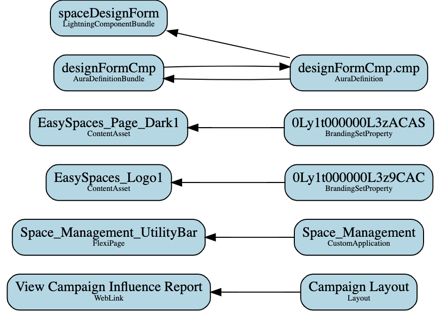
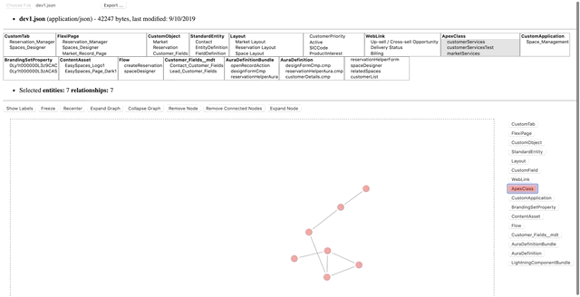
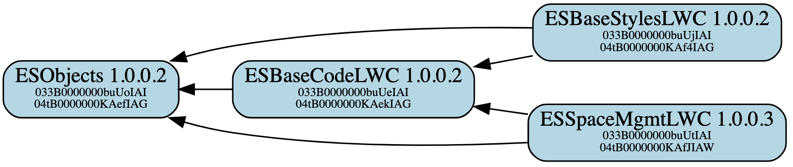

# dependencies-cli

Sample command line utilities around the Salesforce Dependencies API implemented as SFDX plugin.

***The plugin is NOT a Salesforce supported project and release as a community project under open source licenses. Anyone is invited to help improve and extend the code.***

This project implements an SFDX plugin for the [Salesforce Dependencies API](https://releasenotes.docs.salesforce.com/en-us/summer18/release-notes/rn_metadata_metadatacomponentdependency.htm). With the plugin you are able to analyze dependencies between Salesforce [second-generation packages](https://developer.salesforce.com/docs/atlas.en-us.sfdx_dev.meta/sfdx_dev/sfdx_dev_dev2gp_intro.htm) as well as dependencies between Salesforce objects deployed in your org. The plugin is meant for Salesforce developers and administrators trying to

1. Analyze package and object level dependencies
2. Untangle large monolithic orgs to split into smaller (more managable) orgs
3. Indentify and extract base packages with shared objects
4. Identify package level version dependencies

The plugin does not automate any of these steps but uses graph technology to help navigate the complexities of a Salesforce org. The main output thus far is a set of D3.js force directed graphs used to visualize dependencies and recommendation actions.

> Note: Some commands directly need the [Salesforce Dependencies API](https://releasenotes.docs.salesforce.com/en-us/summer18/release-notes/rn_metadata_metadatacomponentdependency.htm) which is currently in open beta for production orgs but fully enabled for sandbox orgs. Please make sure your org has the API enabled or work with Salesforce support to enable it.

> Note: The [Salesforce Dependencies API](https://releasenotes.docs.salesforce.com/en-us/summer18/release-notes/rn_metadata_metadatacomponentdependency.htm) in its current form is limitted to return the first 2000 records of a full query only. As a consequence the plugin can only get the first 2000 objects and the dependency graph is incomplete. While we are wainting for the dependenies API to support full resultset pagination, treat this project as a starter project to a more complete solution.

## Install

0) [Install the Salesforce CLI](https://developer.salesforce.com/docs/atlas.en-us.sfdx_setup.meta/sfdx_setup/sfdx_setup_install_cli.htm) (SFDX)

```
npm install sfdx-cli --global
```

1) Make sure you have the latest version

```
sfdx update
```

2) Install the plugin via npm

```
sfdx plugins:install dependencies-cli
```

3) Test the plugin

```
sfdx dependency
```

returns

```
Sample command line utilities around the Salesforce Dependencies API implemented as SFDX plugin.

USAGE
  $ sfdx dependency:COMMAND

COMMANDS


TOPICS
  Run help for each topic below to view subcommands

  dependency:component  Analyzes object level dependencies in your org
  dependency:package    Analyzes package level dependencies in your dev project
```

4) Authorize an org

For production orgs use 

```
sfdx force:auth:web:login
```

For sandbox orgs use

```
sfdx force:auth:web:login -r https://test.salesforce.com
```

returns

```
Successfully authorized <userId> with org ID <orgId>
You may now close the browser
```

## Usage

The plugin implements two topics with a couple of commmands each:

```
dependency
  |-component
     |---componentizer
     |---report
  |-package
     |---merge
     |---version

```
 
 The two topics help with two disjoint sets of questions where:

`dependency:component` Analyzes ***object*** level dependencies in your org

`dependency:package` Analyzes ***package*** level dependencies in your dev project

Following are a details for every command to illustrate usage only. For detailed command descriptions use

```
sfdx dependency:COMMAND --help
```

## `dependency:component`

Analyzes object level dependencies in your org. All commands are based on the [Salesforce Dependencies API](https://releasenotes.docs.salesforce.com/en-us/summer18/release-notes/rn_metadata_metadatacomponentdependency.htm) and require an org connection with the ```-u, --targetusername=targetusername``` option.

### `dependency:component:componentizer`

Return all leaf nodes in the directed component dependency graph.

USAGE:

```sfdx dependency:component:componentizer [-u <string>] [--apiversion <string>] [--json]```

The response lists the leaf nodes in the directed component dependency graph in a text form, grouped by object type. For example:

```
CustomField:
	CustomerPriority(00N2E000008r3MxUAI)
	NumberofLocations(00N2E000008r3MyUAI)
	SLA(00N2E000008r3MzUAI)
	SLAExpirationDate(00N2E000008r3N0UAI)

WebLink:
	View Campaign Influence Report(00b2E000001Yj9ZQAS)
	Billing(00b2E000001Yj9bQAC)
	Up-sell / Cross-sell Opportunity(00b2E000001Yj9cQAC)

```

### `dependency:component:report`

Produces a dependency graph representing all object level dependencies in your org.


USAGE:

```sfdx dependency:component:report [-r <string>] [-e <string>] [-d <string>] [-x <string> -m] [-a -i <string>] [-t undefined] [-v] [-u <string>] [--apiversion <string>] [--json]```

 This command produces a [DOT formatted](https://www.graphviz.org/doc/info/lang.html) output by default if no `--json` option is used. Following is an example output.

```
digraph graphname {
  rankdir=RL;
  node[shape=Mrecord, bgcolor=black, fillcolor=lightblue, style=filled];
  // Nodes
  X00h11000000s7oIAAQ [label=<Case (Support) Layout<BR/><FONT POINT-SIZE="8">Layout</FONT>>]
  X00b11000000S28TAAS [label=<Up-sell / Cross-sell Opportunity<BR/><FONT POINT-SIZE="8">WebLink</FONT>>]
  X00h11000000s7oJAAQ [label=<Case Layout<BR/><FONT POINT-SIZE="8">Layout</FONT>>]
  X00h11000000s7oNAAQ [label=<Account (Marketing) Layout<BR/><FONT POINT-SIZE="8">Layout</FONT>>]
  X00b11000000S28SAAS [label=<Billing<BR/><FONT POINT-SIZE="8">WebLink</FONT>>]
  X00N11000002qGqQEAU [label=<Account.Contract<BR/><FONT POINT-SIZE="8">CustomField</FONT>>]
  // Paths
  X00h11000000s7oIAAQ->X00b11000000S28TAAS
  X00h11000000s7oJAAQ->X00b11000000S28TAAS
  X00h11000000s7oNAAQ->X00b11000000S28SAAS
  X00h11000000s7oNAAQ->X00N11000002qGqQEAU
}
```

[DOT formatted](https://www.graphviz.org/doc/info/lang.html) output can easily be converted into a vector graph (SVG). You can either paste the output directly into [this website](http://viz-js.com/) for online rendering, or install software to build static or interactive SVG (using [d3.js](https://d3js.org/)).


### 1. Render the SVG as dependency graph in an image<a name="SVG"></a>

- requires [Graphviz](http://graphviz.org/)

```
brew install graphviz
```

- produce the DOT graph file output

```
sfdx dependency:components:report -u [alias|username] -r dot  | tee graph.dot

```

- convert the DOT file to SVG

```
dot -T svg graph.dot > graph.svg
```

- open the SVG directly in your browser (Google Chrome works best)

```
open -a "Google Chrome" graph.svg
```

Following is a small example of a static SVG produced with this process.




### 2. Render the SVG as [d3-force](https://github.com/d3/d3-force) graph

There are two options to launch the D3 graph, using either a pre-deployed Heroku app or running the app locally.

#### 2.1 Use the Node.js app deployed at [https://sfdc-mdapi-graph.herokuapp.com](https://sfdc-mdapi-graph.herokuapp.com)

- produce the graph in JSON format

```
sfdx dependency:components:report -u [alias|username] --json  | tee graph.json
```

- open the browser with [https://sfdc-mdapi-graph.herokuapp.com](https://sfdc-mdapi-graph.herokuapp.com) and load the produced JSON file to render

```
open -a "Google Chrome" https://sfdc-mdapi-graph.herokuapp.com
```

#### 2.2 Run the Node.js app locally

- start the local Node.js server

```
npm start &
```

- produce the graph in JSON format

```
sfdx dependency:components:report -u [alias|username] --json  | tee graph.json
```

- open the browser with [http://localhost:8080](http://localhost:8080/) and select the produced JSON file to render

```
open -a "Google Chrome" http://localhost:8080
```

- to kill the local Node.js server use

```
npm stop
```

Here an example of an interactive force directed D3 graph rendered with the above process.




The force directed graph supports actions to navigate a large graph better, including:

- filter and selection by node type
- filter and selection by node name
- show/hide labels
- freeze the graph simulation
- recenter the graph
- expand the graph for readibility
- collapse the graph to identify center of gravity
- remove individual nodes
- remove a connected graph for a given node
- expand the fully connected graph for a given node
- export filtered subgraph


Using D3.js technology is an attempt to manage large graphs more easily. In addition, one can pass flags to the SFDX plugin directly to apply query filters based on type and thus reduce the output.

## `dependency:package`

Analyzes package level dependencies in your development projects. All commands expect a 2nd generation Salesforce project with one or multiple `package.xml`.

### `dependency:package:merge`

Merge multiple package.xmls to create one base package.xml containing only those objects available across all packages. This function computes the intersection of multiple first generation packages.

USAGE:

```sfdx dependency:package:merge [-h <help>] [-d <string>] [--json]```

 This command produces a properly formatted package.xml as the result of the merge operation, for example:

```
<?xml version="1.0" encoding="UTF-8"?>
<Package xmlns="http://soap.sforce.com/2006/04/metadata">
	<types>
		<members>Reservation_Manager__c</members>
		<members>Spaces_Designer__c</members>
		<name>CustomTab</name>
	</types>
	<types>
		<members>Reservation_Manager</members>
		<members>Spaces_Designer</members>
		<members>Market_Record_Page</members>
		<name>FlexiPage</name>
	</types>
	<types>
		<members>Market__c</members>
		<members>Reservation__c</members>
		<name>CustomObject</name>
	</types>
	<types>
		<members>Lead Layout</members>
		<members>Campaign Layout</members>
		<name>Layout</name>
	</types>
	<version>43.0</version>
</Package>
```

### `dependency:package:version`

Analyze version dependencies for packages deployed in your org using the 2nd generation development process. The command is required to run from within the SFDX project development folder and needs an org connection with the ```-u, --targetusername=targetusername``` option.

USAGE:

```sfdx dependency:package:version [-v <string>] [-u <string>] [--apiversion <string>]```

This command produces a [DOT formatted](https://www.graphviz.org/doc/info/lang.html) output:

```
digraph graphname {
  rankdir=RL;
  node[shape=Mrecord, bgcolor=black, fillcolor=lightblue, style=filled];
  // Nodes
  X04tB0000000KAekIAG [label=<ESBaseCodeLWC 1.0.0.2<BR/><FONT POINT-SIZE="8">033B0000000buUeIAI</FONT><BR/><FONT POINT-SIZE="8">04tB0000000KAekIAG</FONT>>]
  X04tB0000000KAefIAG [label=<ESObjects 1.0.0.2<BR/><FONT POINT-SIZE="8">033B0000000buUoIAI</FONT><BR/><FONT POINT-SIZE="8">04tB0000000KAefIAG</FONT>>]
  X04tB0000000KAf4IAG [label=<ESBaseStylesLWC 1.0.0.2<BR/><FONT POINT-SIZE="8">033B0000000buUjIAI</FONT><BR/><FONT POINT-SIZE="8">04tB0000000KAf4IAG</FONT>>]
  X04tB0000000KAfJIAW [label=<ESSpaceMgmtLWC 1.0.0.3<BR/><FONT POINT-SIZE="8">033B0000000buUtIAI</FONT><BR/><FONT POINT-SIZE="8">04tB0000000KAfJIAW</FONT>>]
  // Paths
  X04tB0000000KAekIAG->X04tB0000000KAefIAG
  X04tB0000000KAf4IAG->X04tB0000000KAefIAG
  X04tB0000000KAf4IAG->X04tB0000000KAekIAG
  X04tB0000000KAfJIAW->X04tB0000000KAefIAG
  X04tB0000000KAfJIAW->X04tB0000000KAekIAG
}
```

To render the output as SVG use the instructions at [Render the SVG as dependency graph in an image](#SVG). Following is an example of a package dependency graph with version details.




## Build and Debug

There are two options to A) build and deploy the sfdx plugin or B) build the node.js application for local testing. Option B is interesting only if you want to maintain different versions, one deployed as SFDX plugin and another one for development testing. Build time is equally fast for both options.

### A Build the SFDX plugin

0) Uninstall the existing plugin

```
sfdx plugins:uninstall dependencies-cli
```

1) Build and install the plugin from the project root folder

```
sfdx plugins:link ./
```

Optionally: in case of errors due to missing dependencies, install them with npm

```
npm install <package> --save
```

2) Test the plugin

```
sfdx dependency
```

### B Build the node.js application for local testing

0) Run yarn clean in the project root folder

```
yarn run clean
```

Optionally: run yarn install in case you used npm package installer to manually install packages

```
yarn install
```

1) Build the code using npm run scripts in the project root folder

```
npm run-script build
```

2) Test your changes with a local bin/run script

```
bin/run dependency
```

### C Debug the SFDX plugin (with VSCode)

0) Run the plugin in debug mode
```
sfdx dependency:<command> --dev-suspend
```

1) Attach 

#### D Debug the node.js application locally

0) Before linking the plugin to Salesforce CLI run
```
NODE_OPTIONS=--inspect-brk bin/run dependency
```

1) Attach VS Code Debugger to `ws://127.0.0.1:9229/<PID>`


## Troubleshooting

__ERROR running dependency:component:componentizer:  sObject type 'MetadataComponentDependency' is not supported.__

Explanation: This error indicates that your org does not have the metadata dependency API enabled. The API is still in beta for production orgs as of release Summer`19.

Resolution: Contact your Salesforce support and provide them the <orgId> to work with. Salesforce support should enable the `Enable MetadataComponentDependency API` perm for your org.

__ERROR running dependency:component:componentizer:  No AuthInfo found for name <userId>__

Explanation: This error indicates that you forgot to provide the -u flag needed for the command execution. The SFDX plugin attempts to use the default user id but requires dedicated authentication info.

Resolution: Supply the `-u <userId>` option with the command.

__ERROR dependencyGraph::retrieveRecords().err sObject type 'CustomField' is not supported.__

Explanation: This error happens with certain orgs where not all metadata object types are supported for query with the tooling API. The error is not fatal and a graph will be produced to STDOUT including all supported metadata types. The error logged to STDERR includes details for the query in question, for example:

```dependencyGraph::retrieveRecords().query SELECT Id, TableEnumOrId FROM CustomField c WHERE c.Id In ('00h0M00000FoNWnQAN','00h30000000i0DcAAI','00h300000012QrnAAE','00h300000012oWtAAI','00h3000000133AJAAY','00h30000001MDH9AAO','00h30000001OIu3AAG','00h30000001OKZ1AAO','00h30000001OLxMAAW','00h30000000gnhbAAA') limit 2000```

Resolution: Contact support to investigate the settings for your org and enable the failing metadata type queries.

